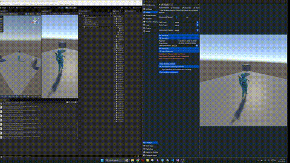
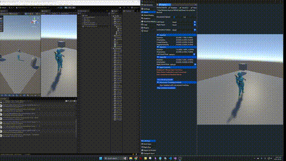
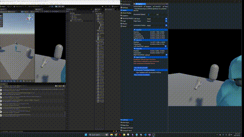
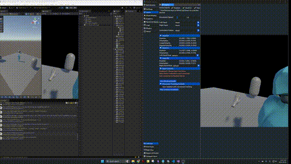
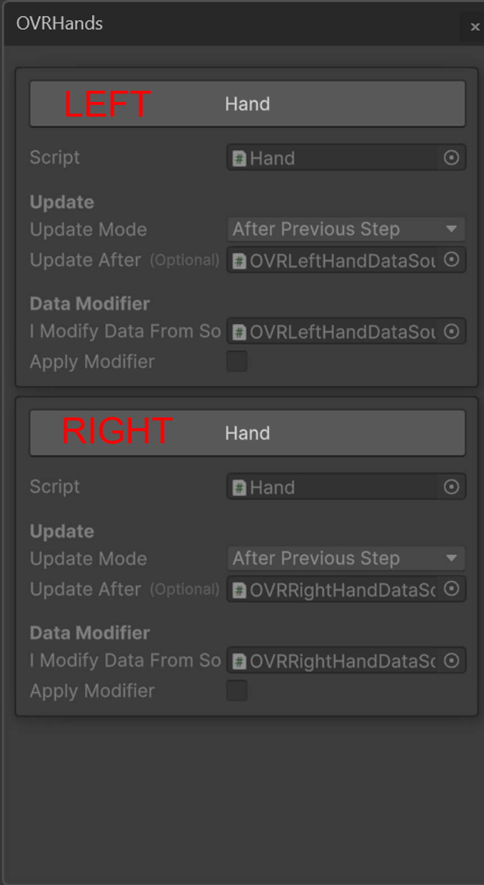

# Participant Manual — SDK A vs SDK B

**Goal:** Follow clear steps to set up the same scene in Unity using **two different SDKs** and verify the results with the simulator.

link: https://docs.google.com/forms/d/e/1FAIpQLSfKta_5VTDDhBr73GycSTtEXZZVMVA3GtLfT6Oyh-QB05UxIw/viewform?usp=header

> Please **follow each step exactly as written**. Do **not** skip or optimize. If a step is unclear, flag the issue to the administrator.

> **Important — Hand–Axis Alignment is pre‑completed** &#x20;
> For this study, all **hand retargeting / axis alignment** for the custom hand meshes was **performed by the research team prior to your session**. You do **not** need to tune axes or run any hand retargeting tools. &#x20;
> *Rationale:* SDK A performs automatic anatomical‑frame alignment via the **XR Hand Retargeter**, removing per‑avatar manual tuning. SDK B does not include built‑in hand‑axis alignment; therefore, we completed the required retargeting and mesh‑specific adjustments **before** sessions to avoid confounding task time and questionnaire ratings.

---
## Quick Checklist (Before You Start)

* [ ] Unity installed: **6000.0.33f1**
* [ ] Project opens without errors
* [ ] Meta Core SDK available for SDK B condition (**78.0.0**)
* [ ] Movement SDK available for SDK B condition (**78.0.0**)
* [ ] Meta XR Simulator available and enabled when needed (**78.0.0**)
* [ ] **Hand–Axis Alignment:** Pre‑session retargeting for custom hand meshes is **already done**. Do **not** perform additional axis tuning.
* [ ] You can see these assets in the **Project** window:

  * **Assets/Scenes/Task-A.unity** and **Assets/Scenes/Task-B.unity**
  * **SceneObjects**, **Y Bot**, **Hands**
  * **Hands** contains **OpenXRCustomHandPrefab\_L** and **OpenXRCustomHandPrefab\_R**

---

## Plain‑Language Glossary (1‑minute read)

* **SDK** (Software Development Kit): A set of tools that adds features to Unity.
* **Prefab**: A ready‑made object you can place into the scene (like a template).
* **Hierarchy**: The list of objects in the current scene (left side of Unity by default).
* **Inspector**: The panel to change settings of the selected object (right side of Unity by default).
* **Project window**: The file browser for assets in your project (bottom of Unity by default).
* **Simulator**: A tool that fakes body and hand movements so you can test without a headset.

You will interact with: **Hierarchy**, **Inspector**, **Project window**, and the **Simulator**.

---

## Start Here — Open Your Assigned Scene

1. In Unity, open the **Project** window.
2. Go to **Assets/Scenes/**.
3. Open both scenes once: **Task-A.unity** and **Task-B.unity**.
4. Double‑click **your assigned scene** (Task‑A or Task‑B) to make it active.

> The scene includes a basic layout: `SceneObjects`, **Y Bot**, and **Hands** with **OpenXRCustomHandPrefab\_L** and **OpenXRCustomHandPrefab\_R**.

> **Note:** Hand retargeting for the provided custom hand prefabs (L/R) was completed before your session. No action is required for axis alignment.
---

## How You Will Check Your Work (both SDKs)

You will compare what you see to short reference clips.

### Run the Simulator

1. In the Unity toolbar, turn on the **Meta Simulator** toggle (next to **Play**).
2. Click **Play**.
3. In the running scene, open **Inputs → Movement Tracking Controls** in the **Meta XR Simulator** window.
4. To test **full body**: click **Play random movement**.
5. To test **hands**: use **WASD** to move hands, or **click** inside the Simulator window to make a **pinch** gesture.

### What “Correct” Looks Like

**SDK A — expected behavior**

<table>
  <tr>
    <td align="center" width="50%">
      
      
<em>Full‑Body Tracking (SDK A)</em>

    </td>
    <td align="center" width="50%">
      
      
<em>Hands Tracking & Retargeting (SDK A)</em>

    </td>
  </tr>
</table>

**SDK B — expected behavior**

<table>
  <tr>
    <td align="center" width="50%">
      
      
<em>Full‑Body Tracking (SDK B)</em>

    </td>
    <td align="center" width="50%">
      
      
<em>Hands Tracking & Retargeting (SDK B)</em>

    </td>
  </tr>
</table>

If your scene behaves like the clips, your setup is **correct**.

---

# Annotated Legend

* \[Hierarchy] — Scene objects in the Hierarchy panel
* \[Project] — Assets/Prefabs in the Project window
* \[Inspector] — Properties edited in the Inspector panel
* \[Component] — Specific component (added/edited in the Inspector)

---

# Task‑A — SDK A

**Goal:**

* Make the custom hand models (**`OpenXRCustomHandPrefab_L/R`**) follow simulated hand motion.
* Make **Y Bot** move with simulated full‑body motion.

---

## Steps — Hands (Hands‑only simulation)
> **Callout — SDK A Hand Alignment** &#x20;
> SDK A uses the **XR Hand Retargeter** for automatic anatomical‑frame alignment. No manual axis tuning is required in this task.

1. **Confirm hand prefabs exist**

* In the <strong>Hierarchy</strong>, expand **`Hands`** \[Hierarchy] → confirm **`OpenXRCustomHandPrefab_L`** and **`OpenXRCustomHandPrefab_R`** are present.

2. **Add Motion Avatar to Hands**

* Select **`Hands`** \[Hierarchy] → in <strong>Inspector</strong> → **Add Component** → add **`Motion Avatar`** \[Component].

3. **Configure Motion Avatar (Hands)**

* On **`Hands`** → **`Motion Avatar`** \[Component], set **`Body Type = Two Hands`** \[Inspector].

4. **Add MotionSystem prefab to the scene (for Hands)**

* From <code>Packages/Unified XR Motion/Assets/Prefabs/MotionSystem.asset</code> \[Project], drag **`MotionSystem`** into the scene

5. **Assemble MotionSystem in the Hierarchy (for Hands)**

* Under **`TrackingSystem`** \[Hierarchy], add **`Meta Hand Tracking`** \[Component].
* Under **`RetargetSystem`** \[Hierarchy], add **`Two Hands Retargeter`** \[Component].
* On **`RetargetSystem / Retarget System`** \[Component]→ set **`Motion Avatar = Hands`** \[Inspector].

6. **Connect the parts (verify each item)**

* In **`Retarget System`** \[Component], add **`Two Hands Retargeter`** to **`Input Motions`** \[Inspector].
* On **`Two Hands Retargeter`** \[Component], set **`Input Motion = TrackingSystem`** \[Inspector].

---

## Steps — Full Body

1. **Add Motion Avatar to Y‑Bot**

* Select **`Y Bot`** \[Hierarchy] → **Inspector** → **Add Component** → add **`Motion Avatar`** \[Component].

2. **Add a separate MotionSystem prefab (for Full Body)**

* From <code>Packages/Unified XR Motion/Assets/Prefabs/MotionSystem.asset</code> \[Project], add another **`MotionSystem`** into the scene. *This full‑body MotionSystem is configured separately from the Hands one.*

3. **Assemble MotionSystem in the Hierarchy (for Full Body)**

* Under **`TrackingSystem`** \[Hierarchy], add **`Meta Body Tracking`** \[Component].
* Under **`RetargetSystem`** \[Hierarchy], add **`Meta Full Body Retarget`** \[Component].
* On **`RetargetSystem / Retarget System`** \[Component]→ set **`Motion Avatar = Y Bot`** \[Inspector].

4. **Connect the parts (verify each item)**

* In **`Retarget System`** \[Component], add **`Meta Full Body Retarget`** to **`Input Motions`** \[Inspector].
* On **`Meta Full Body Retarget`** \[Component], set **`Input Motion = TrackingSystem`** \[Inspector].

---

## Verify — SDK A

1. Turn on the **Meta Simulator** toggle \[Inspector] → click **Play**.
2. **Hands:** move with **WASD** or click for **pinch**.
3. **Full body:** **Inputs → Movement Tracking Controls → Play random movement**.
4. Compare with the **SDK A** reference clips above.

<table>
  <tr>
    <td align="center" width="50%">
      
      
<em>Full‑Body Tracking (SDK A)</em>

    </td>
    <td align="center" width="50%">
      
      
<em>Hands Tracking & Retargeting (SDK A)</em>

    </td>
  </tr>
</table>

---

# Task‑B — SDK B

**Goal:**

* Make **Y Bot** move with simulated full‑body motion.
* Use the provided custom hand models (**`OpenXRCustomHandPrefab_L/R`**) for hands‑only motion.

---

## Steps — Hands (Hands‑only simulation)
> **Callout — SDK B Hand Alignment** &#x20;
> SDK B lacks built‑in hand‑axis alignment. To keep timing and surveys fair, the research team **pre‑retargeted** the custom hand meshes for you. **Do not** run any retargeting tools or change hand axes during the task.

### 1) Add the camera rig

* <strong>Project</strong> → <code>Packages/Meta XR Core SDK/Prefabs</code> \[Project] → drag **`OVRCameraRig`** into the root of the scene.

### 2) Add hand interaction prefabs

* <strong>Project</strong> → <code>Packages/Meta XR Interaction SDK/Runtime/Prefabs</code> \[Project] → drag **`OVRInteractionComprehensive`** **as a child of** **`OVRCameraRig`** \[Hierarchy].
* Keep only **`OVRHands`** under **`OVRInteractionComprehensive`** \[Hierarchy]. (remove extras; e.g. OVRHmd, OVRControllers, LeftInteractions, RightInteractions, OVRLeftHandVisual, OVRRightHandVisual, OVRLeftControllerVisual, OVRRightControllerVisual, and Locomotor) 
* Select **`OVRInteractionComprehensive`** \[Hierarchy] → in <strong>Inspector</strong>, set **`OVR Camera Rig Ref` → `OVR Camera Rig = OVRCameraRig`**.

### 3) Add synthetic hands for simulation

* <strong>Project</strong> → <code>Packages/Meta XR Interaction SDK Essentials/Runtime/Prefabs/Hands/</code> \[Project]

  * Add **`OVRLeftHandSynthetic`** and **`OVRRightHandSynthetic`** **as children of** `OVRCameraRig/OVRInteractionComprehensive` \[Hierarchy].

### 4) Remove default hand visuals

* Under **`OVRLeftHandSynthetic/OVRLeftHandVisual`** \[Hierarchy], delete **`OpenXRLeftHand`** and **`OculusHand_L`** (if present).
* Under **`OVRRightHandSynthetic/OVRRightHandVisual`** \[Hierarchy], delete **`OpenXRRightHand`** and **`OculusHand_R`** (if present).

### 5) Add the custom hand prefabs

* Drag **`OpenXRCustomHandPrefab_L`** under `OVRLeftHandSynthetic/OVRLeftHandVisual` \[Hierarchy] from the Project \[Project].
* Drag **`OpenXRCustomHandPrefab_R`** under `OVRRightHandSynthetic/OVRRightHandVisual` \[Hierarchy] from the Project \[Project].

### 6) Adjust Hand Visual settings

**For Left**

* Select **`OVRLeftHandVisual`** \[Hierarchy] → in **Hand Visual** \[Component], enable **`Update Root Pose`** and **`Update Root Scale`** \[Inspector].
* In **Open XR Skinned Mesh Renderer** field \[Inspector], assign **`LeftHand`** (child with **Skinned Mesh Renderer**) under `OpenXRCustomHandPrefab_L/OpenXRLeftHand` \[Hierarchy].
* Select **`OpenXRCustomHandPrefab_L`** \[Hierarchy] → in **OVR Custom Skeleton** \[Component], enable **`Update Root Pose`** and **`Update Root Scale`** \[Inspector].

**For Right**

* On **`OVRRightHandVisual`** \[Hierarchy], enable **`Update Root Pose`** and **`Update Root Scale`** in **Hand Visual** \[Component] via \[Inspector].
* Assign **Open XR Skinned Mesh Renderer** to **`RightHand`** (child with **Skinned Mesh Renderer**) under `OpenXRCustomHandPrefab_R/OpenXRRightHand` \[Inspector].
* On **`OpenXRCustomHandPrefab_R`** → **OVR Custom Skeleton** \[Component], enable **`Update Root Pose`** and **`Update Root Scale`** \[Inspector].

### 7) Link DataModifier components (synthetic → live hand data)

* Select **`OVRLeftHandSynthetic`** \[Hierarchy].

  * In **`DataModifier | Modify Data From Source`** \[Component], set **Source = `OVRHands`** (child under **`OVRInteractionComprehensive`**) \[Inspector].
  * In the mini Left/Right UI, ensure **Left** reads from **`OVRHands.Left`** \[Inspector].
* Select **`OVRRightHandSynthetic`** \[Hierarchy].

  * In **`DataModifier | Modify Data From Source`** \[Component], set **Source = `OVRHands`** and ensure **Right** reads from **`OVRHands.Right`** \[Inspector].

  

---

## Steps — Full Body

### 1) Enable body tracking on the rig

* Select **`OVRCameraRig`** \[Hierarchy] → **`OVRManager`** \[Component] in <strong>Inspector</strong> \[Inspector].

  * **Tracking Origin Type = Floor Level** \[Inspector]
  * **Body Tracking Support = Required** \[Inspector]
  * **Body Tracking Joint Set = Full Body** \[Inspector]
  * *(Optional)* **Hand Tracking Support = Controllers And Hands** \[Inspector]

### 2) Create a Movement SDK retargeting config for Y‑Bot

* In **Project**, right‑click the **Y‑Bot model asset** \[Project] → **Movement SDK → Body Tracking → Open Retargeting Configuration Editor**.
* In the wizard: click **Next**, review mappings → **Validate and Save Config** → **Done**.

### 3) Add a Character Retargeter to Y‑Bot

* Right‑click **Y‑Bot** again \[Project] → **Movement SDK → Body Tracking → Add Character Retargeter**.
* In the wizard: select the **retargeting config** you saved → **Validate and Save Config** → **Done**.
* In **Hierarchy**, select your **Y‑Bot instance** \[Hierarchy] → confirm a **`CharacterRetargeter`** \[Component] is added and references the saved **Retargeting Config** \[Inspector].

---

### Verify — SDK B

1. Turn on the **Meta Simulator** toggle → click **Play**.
2. Full body: **Inputs → Movement Tracking Controls → Play random movement**.
3. Hands: use **WASD** or click for **pinch**.
4. Compare with the **SDK B** reference clips.

<table>
  <tr>
    <td align="center" width="50%">
      
      
<em>Full‑Body Tracking (SDK B)</em>

    </td>
    <td align="center" width="50%">
      
      
<em>Hands Tracking & Retargeting (SDK B)</em>

    </td>
  </tr>
</table>

---

## Troubleshooting (Quick Fixes)

* **I don’t see the Simulator panel.** Stop Play mode. Toggle the **Meta Simulator** off and on, then press **Play** again.
* **Hands don’t move.** Recheck that **OVRHands** is assigned to both **DataModifier** components (Meta task) or that **Two Hands Retargeter** input is the **TrackingSystem** (Task A).
* **Y Bot doesn’t move.** Confirm **Body Tracking** is enabled (Meta task) or that **Meta Body Tracking** feeds into **Meta Body Retargeter** with **Motion Avatar = Y Bot** (Task A).
* **Pink/missing models.** Ensure the **OpenXRCustomHandPrefab\_L/R** and **Y Bot** objects are present in the **Hierarchy** and their materials are assigned in the **Inspector**.

---

## After You Finish

1. Compare your scene behavior to the reference clips.
2. If your result matches, tell the administrator you are done.
3. Complete the questionnaires: **NASA‑TLX** and **SUS**.
4. Submit the survey here: **[Study Survey Link](https://docs.google.com/forms/d/e/1FAIpQLSfKta_5VTDDhBr73GycSTtEXZZVMVA3GtLfT6Oyh-QB05UxIw/viewform?usp=header)**.

> Focus on **accuracy** and **task completion**, not speed.

---

## Version & Date

* **Unity**: 6000.0.33f1
* **Meta Core SDK**: 78.0.0 (SDK B condition)
* **Movement SDK**: 78.0.0 (SDK B condition)
* **Meta XR Simulator**: 78.0.0
* Manual last updated: **September 3, 2025**
