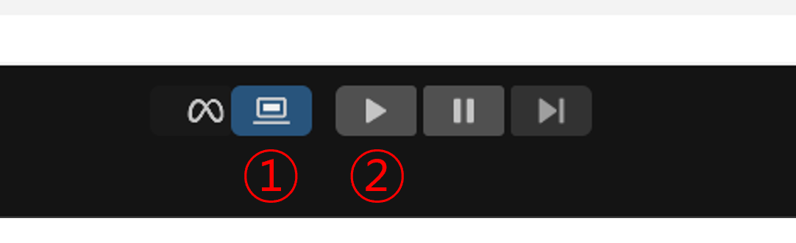
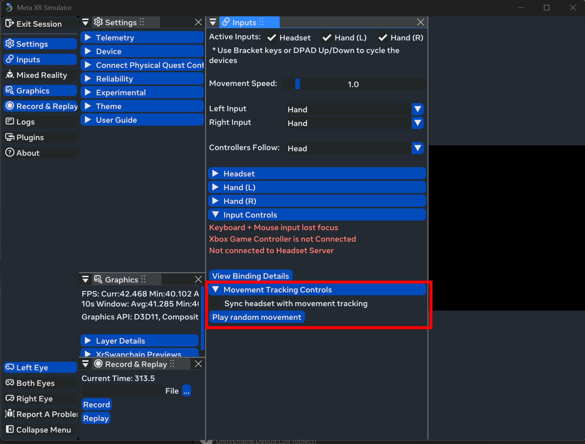
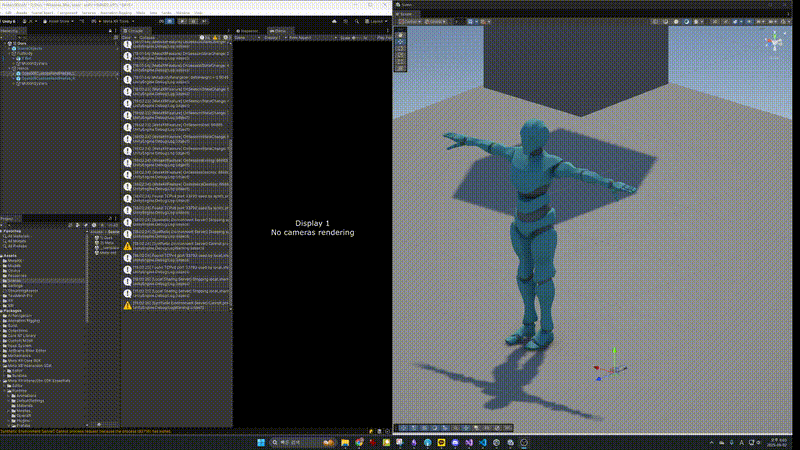

# Participant Manual — UnifiedXRMotion vs Meta SDK 

> **Important — After You Finish the Tasks**
>
> 1. **Complete the questionnaire:** After finishing all assigned tasks, please fill out the study survey here: **[Survey Link](https://docs.google.com/forms/d/e/1FAIpQLSeOqFWpfYdhKt8Hf3-RucCyR9Qm7beGRRzhLZ2IWdvW0Bi3Mw/viewform?usp=header&utm_source=chatgpt.com)**.
>
> 2. **Confirm your results:** If you believe you completed all tasks successfully, please scroll down to the final section of this manual and compare your outcome with the provided result videos (**UnifiedXRMotion** and **Meta**).
>
> To check the task result:
>
> 1. Enable the simulator and press the Play button, as shown below:
>
> 

>   
> 

>
> 2. Once the scene is running, open **Inputs → Movement Tracking Controls** in the Meta simulator.
> 3. Press the **Play random movement** button, as shown below:
>
> 

>   
> 

>
> If the observed result matches the expected outcome, inform the experiment administrator that the session is complete.

This manual provides two parallel sets of instructions for identical Unity tasks using two SDKs:

* **UnifiedXRMotion** (our SDK)
* **Meta SDK** (Meta Core SDK + Meta XR Interaction SDK, with Movement SDK for full‑body retargeting)

Both manuals use the same wording style and level of detail for fair comparison. Follow each step as written; do not optimize for speed.

---

## Start Here — Make a Copy of the Template Scene

You will begin from a prepared Unity project.

1. In the **Project** window, go to **Assets/Scenes/**.
2. Right‑click **\_\_template.unity** → **Duplicate**. Rename the copy (for example, **ParticipantScene.unity**).
3. Double‑click your new scene to open it.

> The template scene already includes the basic layout shown in the study materials (SceneObjects, **FullBody** with **Y Bot**, and **Hands** with **OpenXRCustomHandPrefab\_L** and **OpenXRCustomHandPrefab\_R**).

---

## Manual A — UnifiedXRMotion

### Before You Start

* **Unity version:** 6000.0.33f1
* **Installed:** UnifiedXRMotion, OpenXR (Desktop → Meta XR Feature Group enabled), Meta Core SDK, Meta XR Simulator (77.0.0)
* If something is already set up in the scene, simply **confirm** it and continue.

### Task 1 — Move the Y Bot Character (Full Body)

**Goal:** Make **Y Bot** move with simulated full‑body motion.

**Steps**

1. In the **Hierarchy**, expand **FullBody** and select **Y Bot**.
2. In the **Inspector**, click **Add Component** and add **Motion Avatar**.
3. In the **Hierarchy**, locate **MotionSystem**. If it does not exist, create it:

   * Create Empty **MotionSystem** and add component **Motion System**.
   * As children, create **TrackingSystem** (add components **Tracking Manager** and **Meta Body Tracking**) and **RetargetSystem** (add components **Retarget System** and **Meta Body Retargeter**).
4. **Connect the systems** (verify or complete):

   * Select **MotionSystem** → in **Motion System**, add **TrackingSystem** to **Motion Triggers**.
   * Select **RetargetSystem** → in **Retarget System**, set **Motion Avatar** to **Y Bot**.
   * In **Retarget System**, add **Meta Body Retargeter** to **Input Motions**.
   * Select **Meta Body Retargeter** (on **RetargetSystem**) and set its **Input Motion** to **TrackingSystem**.

**Expected Outcome**

* When simulated movement plays, **Y Bot** moves smoothly (head, torso, arms, legs).

### Task 2 — Hands‑Only Tracking and Retargeting (Custom Hand Models)

**Goal:** Make the provided custom hand models (**OpenXRCustomHandPrefab\_L/R**) follow simulated hand motion.

**Steps**

1. In the **Hierarchy**, expand **Hands** and confirm **OpenXRCustomHandPrefab\_L** and **OpenXRCustomHandPrefab\_R** are present.
2. Select **Hands**. In the **Inspector**, click **Add Component** and add **Motion Avatar**.
3. In **Motion Avatar**, set **Body Type** to **Two Hands**.
4. In the **Hierarchy**, locate (or create) the hands motion system:

   * Create **MotionSystem** (if missing) and add **Motion System**.
   * Create child **TrackingSystem** and add **Tracking Manager** and **Meta Hand Tracking**.
   * Create child **RetargetSystem** and add **Retarget System** and **Two Hands Retargeter**.
5. **Connect the systems** (verify or complete):

   * On **MotionSystem**, add **TrackingSystem** to **Motion Triggers**.
   * On **Retarget System** (under **RetargetSystem**), set **Motion Avatar** to **Hands**.
   * In **Retarget System**, add **Two Hands Retargeter** to **Input Motions**.
   * On **Two Hands Retargeter**, set **Input Motion** to **TrackingSystem**.

**Expected Outcome**

* When simulated movement plays, the custom left and right hands animate and mirror basic poses.

### Verify With Meta Simulator (UnifiedXRMotion)

1. In the Unity toolbar, enable the **Meta Simulator** toggle (next to **Play**).
2. Click **Play**.
3. Open **Inputs → Movement Tracking Controls → Play random movement**.

**Expected Outcome**

* The current target (Y Bot for Task 1, Hands for Task 2) animates following the random motion.
* If there is no motion, stop Play, review the connections above, and try again.

---

## Manual B — Meta SDK (Core + Interaction + Movement)

### Before You Start

* **Unity version:** 6000.0.33f1
* **Installed:** OpenXR (Desktop → Meta XR Feature Group enabled), Meta Core SDK, Meta XR Interaction SDK, Meta XR Simulator (77.0.0), Movement SDK (78.0.0)
* If something is already set up in the scene, simply **confirm** it and continue.

### Task 1 — Move the Y Bot Character (Full Body)

**Goal:** Make **Y Bot** move with simulated full‑body motion.

**Steps**

1. **Add the camera rig**

   * In **Project** → **Packages/Meta XR Core SDK/Prefabs**, drag **OVRCameraRig** into the **Hierarchy**.
2. **Enable body tracking**

   * Select **OVRCameraRig** → in **Inspector**, find **OVRManager**.
   * Under **Quest Features**, set **Body Tracking Support** to **Required**.
   * Under **Movement Tracking**, set **Body Tracking Joint Set** to **Full Body**.
3. **Retarget Y Bot** (Movement SDK)

   * In **Project**, right‑click the **Y Bot** model asset.
   * Choose **Movement SDK → Body Tracking → Open Retargeting Configuration Editor**.
   * If prompted, create and save the config JSON.
   * Right‑click **Y Bot** again → **Movement SDK → Body Tracking → Add Character Retargeter**.

**Expected Outcome**

* When simulated movement plays, **Y Bot** follows full‑body motion.

### Task 2 — Hands‑Only Tracking and Retargeting (Custom Hand Models)

**Goal:** Use the provided custom hand models (**OpenXRCustomHandPrefab\_L/R**) for hands‑only motion.

**Steps**

1. **Add hand interaction prefabs**

   * In **Project** → **Packages/Meta XR Interaction SDK/Runtime/Prefabs**, drag **OVRInteractionComprehensive** as a **child** of **OVRCameraRig**.
   * Under **OVRInteractionComprehensive**, keep **OVRHands** (you can remove other extras).
2. **Add synthetic hands for simulation**

   * In **Project** → **Packages/Meta XR Interaction SDK Essentials/Runtime/Prefabs/Hands**, add **OVRLeftHandSynthetic** and **OVRRightHandSynthetic** as children under **OVRCameraRig** (or alongside the hands setup).
3. **Remove default hand visuals**

   * Under **OVRLeftHandSynthetic**, delete the default objects named **OpenXRLeftHand** and **OculusHand\_L** (if present).
   * Under **OVRRightHandSynthetic**, delete the default objects named **OpenXRRightHand** and **OculusHand\_R** (if present).
4. **Add the custom hand prefabs**

   * Drag **OpenXRCustomHandPrefab\_L** under **OVRLeftHandSynthetic/OVRLeftHandVisual**.
   * Drag **OpenXRCustomHandPrefab\_R** under **OVRRightHandSynthetic/OVRRightHandVisual**.
5. **Adjust Hand Visual settings**

   * In the **Hierarchy**, select **OVRLeftHandVisual**.

     * In the **Inspector** under **Hand Visual**, enable **Update Root Pose** and **Update Root Scale**.
     * For **Open XR Skinned Mesh Renderer**, assign the **LeftHand** child of **OpenXRCustomHandPrefab\_L** (the one that has a **Skinned Mesh Renderer** component).
   * Select **OVRRightHandVisual**.

     * Enable **Update Root Pose** and **Update Root Scale**.
     * For **Open XR Skinned Mesh Renderer**, assign the **RightHand** child of **OpenXRCustomHandPrefab\_R** (the one that has a **Skinned Mesh Renderer** component).

**Expected Outcome**

* When simulated movement plays, the custom left and right hands animate correctly using the provided models.

### Verify With Meta Simulator (Meta SDK)

1. In the Unity toolbar, enable the **Meta Simulator** toggle (next to **Play**).
2. Click **Play**.
3. Open **Inputs → Movement Tracking Controls → Play random movement**.

**Expected Outcome**

* The current target (Y Bot for Task 1, Hands for Task 2) animates following the random motion.
* If there is no motion, stop Play, review the steps above, and try again.

---

## Final Reminder (for both SDKs)

Please focus on **completing the tasks** rather than speed. After you finish, your **subjective workload and usability** will be measured using the **NASA‑TLX** and **SUS** questionnaires.

## Result Videos

<table>
  <tr>
    <td align="center" width="50%">
      
      
<em>UnifiedXRMotion (ours)</em>

    </td>
    <td align="center" width="50%">
      
      
<em>Meta SDK</em>

    </td>
  </tr>
</table>